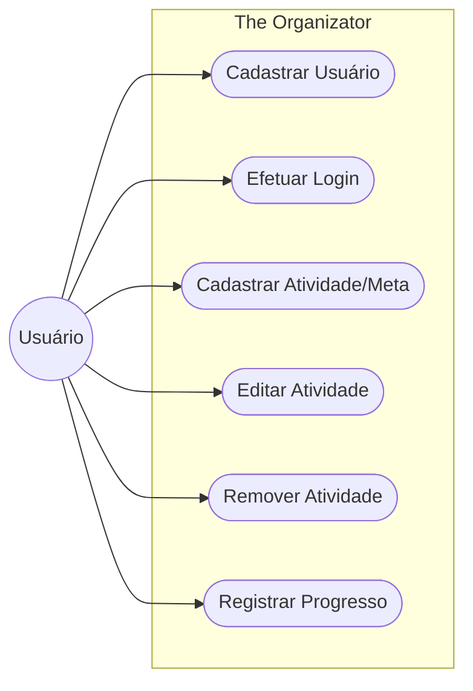

## 5.1 Diagrama de Casos de Uso

```mermaid
flowchart LR
  U((Usuário))

  subgraph The Organizator
    UC1([Cadastrar Usuário])
    UC2([Efetuar Login])
    UC3([Cadastrar Atividade/Meta])
    UC4([Editar Atividade])
    UC5([Remover Atividade])
    UC6([Registrar Progresso])
  end

  U --> UC1
  U --> UC2
  U --> UC3
  U --> UC4
  U --> UC5
  U --> UC6
```
