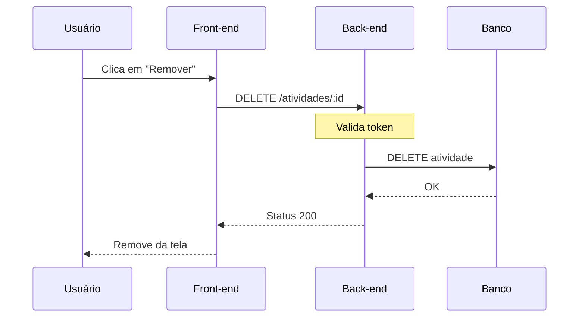

---

## 📄 sequencia.md

````md
# Diagrama de Sequência


```mermaid
sequenceDiagram

participant U as Usuário
participant F as Front-end
participant B as Back-end
participant DB as Banco

U->>F: Clica em "Remover"
F->>B: DELETE /atividades/:id
Note over B: Valida token
B->>DB: DELETE atividade
DB-->>B: OK
B-->>F: Status 200
F-->>U: Remove da tela
```
````
