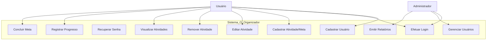
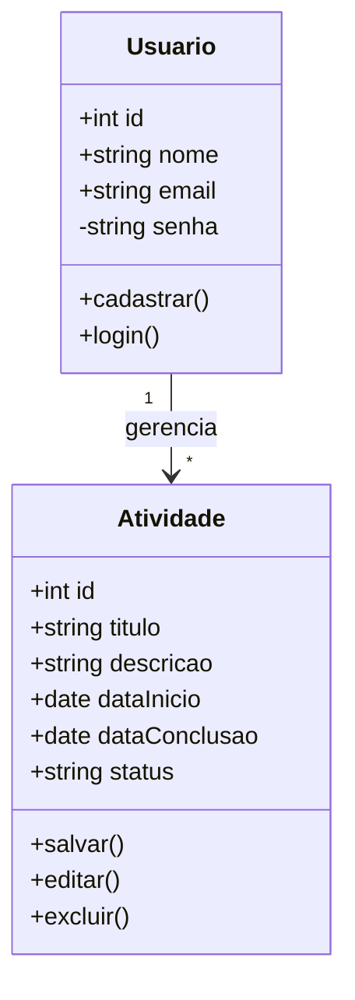
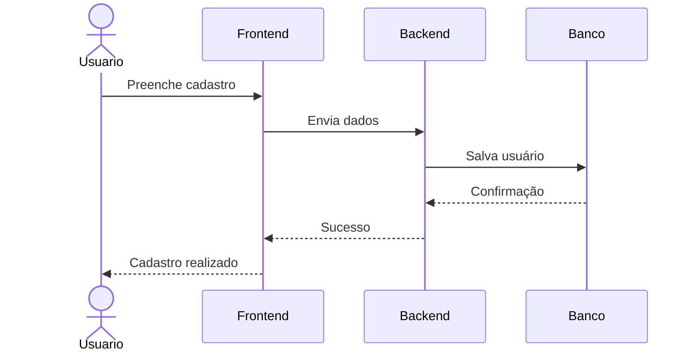
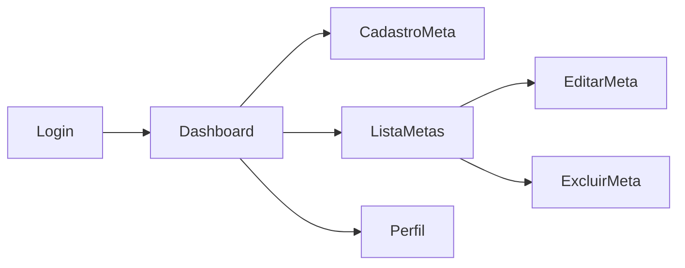

# Documentação Final do Projeto

**Nome do Projeto:** The_Organizator  
**Equipe:** Gilvan, Rodrigo, Rafael e Victor  
**Disciplina:** Projeto Integrador 2 e Web 3  
**Instituição:** IFCE – Campus Maranguape  
**Semestre:** Terceiro

---

# Sumário

1. [Introdução](#1-introdução)  
   1.1 [Objetivo do Documento](#11-objetivo-do-documento)  
   1.2 [Público-alvo](#12-público-alvo)

2. [Visão Geral do Sistema](#2-visão-geral-do-sistema)  
   2.1 [Descrição Resumida](#21-descrição-resumida)  
   2.2 [Funcionalidades Principais](#22-funcionalidades-principais)  
   2.3 [Escopo do Sistema](#23-escopo-do-sistema)

3. [Requisitos do Sistema](#3-requisitos-do-sistema)  
   3.1 [Requisitos Funcionais](#31-requisitos-funcionais)  
   3.2 [Requisitos Não Funcionais](#32-requisitos-não-funcionais)

4. [Arquitetura e Tecnologias Utilizadas](#4-arquitetura-e-tecnologias-utilizadas)  
   4.1 [Arquitetura Geral](#41-arquitetura-geral)  
   4.2 [Tecnologias Utilizadas](#42-tecnologias-utilizadas)  
   4.3 [Padrões e Boas Práticas Adotados](#43-padrões-e-boas-práticas-adotados)

5. [Diagramas do Sistema](#5-diagramas-do-sistema)  
   5.1 [Diagrama de Casos de Uso](#51-diagrama-de-casos-de-uso)  
   5.2 [Diagrama de Classes / Modelo de Dados](#52-diagrama-de-classes--modelo-de-dados)  
   5.3 [Diagrama de Sequência (Opcional)](#53-diagrama-de-sequência-opcional)  
   5.4 [Diagrama de Navegação (Opcional)](#54-diagrama-de-navegação-opcional)

6. [Descrição dos Módulos e Componentes](#6-descrição-dos-módulos-e-componentes)  
   6.1 [Organização das Pastas](#61-organização-das-pastas)  
   6.2 [Módulos do Sistema](#62-módulos-do-sistema)  
   6.3 [Fluxo de uma Operação Importante](#63-fluxo-de-uma-operação-importante)

7. [Guia de Instalação e Execução](#7-guia-de-instalação-e-execução)  
   7.1 [Pré-requisitos](#71-pré-requisitos)  
   7.2 [Como Clonar o Repositório](#72-como-clonar-o-repositório)  
   7.3 [Instalação e Execução do Back-end](#73-instalação-e-execução-do-back-end)  
   7.4 [Instalação e Execução do Front-end](#74-instalação-e-execução-do-front-end)  
   7.5 [Variáveis de Ambiente](#75-variáveis-de-ambiente)

8. [Manual do Usuário](#8-manual-do-usuário)  
   8.1 [Tela Inicial](#81-tela-inicial)  
   8.2 [Login e Cadastro](#82-login-e-cadastro)  
   8.3 [Cadastro de Trilhas / Receitas](#83-cadastro-de-trilhas--receitas)  
   8.4 [Edição e Exclusão](#84-edição-e-exclusão)  
   8.5 [Erros Comuns e Soluções](#85-erros-comuns-e-soluções)

9. [Decisões de Projeto e Limitações](#9-decisões-de-projeto-e-limitações)  
   9.1 [Decisões Importantes](#91-decisões-importantes)  
   9.2 [Limitações da Versão Atual](#92-limitações-da-versão-atual)

10. [Testes Unitários com Jest](#10-testes-unitários-com-jest)  
    10.1 [Objetivo dos Testes](#101-objetivo-dos-testes)  
    10.2 [Tecnologias Utilizadas](#102-tecnologias-utilizadas)  
    10.3 [Como Executar os Testes](#103-como-executar-os-testes)  
    10.4 [Organização dos Arquivos de Teste](#104-organização-dos-arquivos-de-teste)  
    10.5 [Testes Implementados no Projeto](#105-testes-implementados-no-projeto)  
    10.6 [Exemplo de Teste Criado](#106-exemplo-de-teste-criado)  
    10.7 [Benefícios dos Testes Unitários](#107-benefícios-dos-testes-unitários)

11. [Referências](#11-referencias)

---

# 1. Introdução

## 1.1 Objetivo do Documento

Este documento reúne a documentação técnica e de usuário do sistema _The_Organizator_, desenvolvido no âmbito da disciplina de Projeto Integrador 2 e Web 3. O sistema tem como finalidade auxiliar no controle e gerenciamento de metas pessoais, permitindo ao usuário planejar, acompanhar e concluir suas atividades de forma organizada e eficiente.

## 1.2 Público-alvo

Este documento é destinado ao professore e avaliador do projeto, desenvolvedores interessados na estrutura e funcionamento do sistema, bem como usuários que desejam compreender as funcionalidades e a forma de utilização do **The_Organizator**.

---

# 2. Visão Geral do Sistema

## 2.1 Descrição Resumida

O **The_Organizator** é um sistema web desenvolvido para auxiliar no gerenciamento de metas e tarefas pessoais. Ele permite que os usuários organizem suas atividades, acompanhem seu progresso e mantenham o controle de suas ações de forma prática e eficiente.

## 2.2 Funcionalidades Principais

- Cadastro e autenticação de usuários
- Criação, edição e exclusão de metas
- Definição de prazos e acompanhamento de progresso
- Visualização organizada das tarefas
- Atualização do status das atividades

## 2.3 Escopo do Sistema

**Funcionalidades incluídas nesta versão:**

- Cadastro e autenticação de usuários
- Criação, edição e exclusão de metas
- Definição de datas de início e término
- Visualização das metas cadastradas
- Atualização do status das atividades

**Funcionalidades fora do escopo (ou previstas para versões futuras):**

- Integração com outros sistemas ou APIs externas
- Envio de notificações ou lembretes automáticos
- Compartilhamento de metas entre usuários
- Aplicativo mobile nativo
- Relatórios avançados e análise de desempenho

---

# 3. Requisitos do Sistema

## 3.1 Requisitos Funcionais

Requisitos do Sistema: Organizador de Atividades The_Organizator  
Requisitos Funcionais (RF)

- **RF01:** O sistema deve permitir que novos usuários se cadastrem informando usuário e senha.

- **RF02:** O sistema deve realizar a autenticação do usuário (Login) comparando as credenciais com os dados armazenados.

- **RF03:** O sistema deve permitir que o usuário logado adicione novas tarefas à sua lista.

- **RF04:** O sistema deve exibir uma lista dinâmica com todas as tarefas cadastradas pelo usuário.

- **RF05:** O sistema deve permitir que o usuário limpe toda a sua lista de atividades de uma só vez.

- **RF06:** O sistema deve permitir que o usuário saia da aplicação (Logout), retornando à tela inicial.

## 3.2 Requisitos Não Funcionais

- **RNF01:** (Usabilidade): A interface deve ser responsiva e centralizada, garantindo boa visualização em diferentes tamanhos de tela.

- **RNF02:** (Desempenho): A transição entre as telas (Home, Login, Cadastro, App) deve ser instantânea, sem recarregamento de página (conceito de SPA).

- **RNF03:** (Segurança): O campo de senha no formulário de Login e Cadastro deve ocultar os caracteres digitados (tipo password).

- **RNF04:** (Compatibilidade): O sistema deve ser executável em qualquer navegador moderno (Chrome, Firefox, Safari) via suporte a HTML5, CSS3 e ES6+.

- **RNF05:** (Arquitetura): O código deve ser modularizado, separando a lógica de interface (ui.js) da lógica de aplicação (app.js).

Versão do Documento  
Atualizado em: 30/03/2026

Responsáveis: Victor, Gilvan Silva, Rodrigo e Rafael

---

# 4. Arquitetura e Tecnologias Utilizadas

## 4.1 Arquitetura Geral

O sistema _The_Organizator_ segue uma arquitetura cliente-servidor, dividida em duas partes principais: frontend e backend. O frontend é responsável pela interface com o usuário, enquanto o backend gerencia as regras de negócio, autenticação e comunicação com o banco de dados.

A comunicação entre as camadas ocorre por meio de requisições HTTP, garantindo a separação de responsabilidades e facilitando a manutenção do sistema.

## 4.2 Tecnologias Utilizadas

Liste por camadas.

**Front-end:**

- React
- Vite / Create React App (ou outra ferramenta utilizada)
- React Router

**Stack completo:**

- **Frontend:** React.js para construção da interface do usuário
- **Backend:** Node.js com Express para criação da API
- **Banco de Dados:** SQL (MySQL) para armazenamento das informações
- **Controle de Versão:** Git e GitHub para versionamento do projeto
- **Ambiente de Desenvolvimento:** Visual Studio Code

## 4.3 Padrões e Boas Práticas Adotados

- Separação entre frontend e backend
- Organização modular do código
- Uso de padrões REST para comunicação da API
- Versionamento de código com Git (branches como main e feature)
- Escrita de código limpo e legível
- Tratamento de erros no backend

---

# 5. Diagramas do Sistema

# 5. Diagramas do Sistema

## 5.1 Diagrama de Casos de Uso



---

## 5.2 Diagrama de Classes / Modelo de Dados



---

## 5.3 Diagrama de Sequência



---

## 5.4 Diagrama de Navegação



# 6. Descrição dos Módulos e Componentes

## 6.1 Organização das Pastas

### BackEnd

O projeto _The_Organizator_ está dividido em módulos principais, separando back-end, front-end e documentação para facilitar a organização e manutenção do sistema.

```text
backEnd/
├── src/
│   ├── controllers/                 # Controladores responsáveis por receber requisições
│   │                                # e executar as regras de negócio do sistema
│   │
│   ├── routes/                      # Define as rotas da API utilizadas pelo front-end
│   │                                # Ex.: login, cadastro, metas e atividades
│   │
│   ├── config/                      # Arquivos de configuração do servidor,
│   │                                # variáveis de ambiente e ajustes gerais
│   │
│   ├── services/                    # Serviços auxiliares e funções reutilizáveis
│   │                                # para processamento interno
│   │
│   ├── models/                      # Estruturas de dados e representação
│   │                                # das entidades do sistema (se houver)
│   │
│   └── database/                    # Conexão com banco de dados,
│                                    # consultas e scripts SQL
│
├── package.json                     # Dependências do back-end e scripts de execução
│
├── package-lock.json                # Controle de versões das dependências instaladas
│
├── server.js                        # Arquivo principal que inicializa o servidor Node.js
│                                    # e configura o Express
│
└── README.md                        # Documentação específica do back-end
```

### FrontEnd

#### Estrutura HTML, CSS e JavaScript

```text
frontEnd-final/
├── _images/                          # Imagens, ícones e fotos utilizadas no sistema
│   ├── facebook.png                  # Ícone da rede social Facebook
│   ├── instagram.png                 # Ícone da rede social Instagram
│   ├── whatsapp.png                  # Ícone do WhatsApp
│   ├── email.png                     # Ícone de e-mail
│   ├── map.png                       # Imagem relacionada à localização/mapa
│   └── fotos da equipe               # Imagens dos integrantes do projeto
│
├── scripts/
│   ├── api.js                        # Responsável pela comunicação com o back-end
│   ├── app.js                        # Funções principais e lógica da aplicação
│   └── ui.js                         # Manipulação visual da interface
│
├── styles/
│   └── style.css                     # Estilos globais das páginas
│
├── index.html                        # Página inicial do sistema
├── login.html                        # Tela de login do usuário
├── cadastro.html                     # Tela de cadastro de novos usuários
├── dashboard.html                    # Painel principal após autenticação
├── contato.html                      # Página com formas de contato
├── sobre.html                        # Página sobre o projeto e equipe
└── recuperar-senha.html              # Tela de recuperação de senha

frontend-react/
├── node_modules/                    # Dependências instaladas automaticamente pelo npm
│
├── public/                          # Arquivos públicos acessados diretamente
│
├── src/
│   ├── assets/                      # Imagens, estilos e recursos visuais
│   ├── components/                  # Componentes reutilizáveis da interface
│   ├── pages/                       # Páginas principais do sistema
│   ├── services/                    # Serviços e comunicação com API
│   └── App.jsx                      # Componente principal da aplicação
│
├── index.html                       # Página raiz utilizada pelo Vite
├── package.json                     # Dependências e scripts do projeto
├── package-lock.json                # Controle de versões das dependências
├── vite.config.js                   # Configuração do ambiente Vite
├── eslint.config.js                 # Configuração de padronização do código
└── README.md                        # Documentação do front-end React
```

## 6.2 Módulos do Sistema

Descrevem-se, a seguir, os principais módulos que compõem o sistema _The_Organizator_:

- **Módulo de Autenticação** – responsável pelo cadastro de usuários, login no sistema e controle de acesso às funcionalidades protegidas.

- **Módulo de Metas e Atividades** – responsável pelo cadastro, edição, listagem e exclusão de metas ou atividades pessoais.

- **Módulo de Progresso** – responsável pelo acompanhamento do andamento das metas, permitindo registrar status parcial ou concluído.

- **Módulo de Dashboard / Página Inicial** – responsável por apresentar ao usuário uma visão geral das metas cadastradas e das principais informações do sistema.

- **Módulo de Interface** – responsável pela interação visual entre usuário e sistema, incluindo formulários, botões, páginas e navegação.

---

## 6.3 Fluxo de uma Operação Importante

A seguir, apresenta-se o fluxo de uma operação essencial do sistema: **cadastro de uma nova meta/atividade**.

1. O usuário acessa o sistema e realiza login.
2. O usuário entra na tela de cadastro de metas.
3. O usuário preenche os campos obrigatórios, como título, descrição e datas.
4. O front-end envia uma requisição POST para a API do sistema.
5. O back-end recebe e valida os dados informados.
6. As informações são salvas no banco de dados.
7. O back-end retorna uma resposta de sucesso.
8. O front-end exibe uma mensagem de confirmação ao usuário.
9. A nova meta é exibida na lista de atividades cadastradas.

---

# 7. Guia de Instalação e Execução

## 7.1 Pré-requisitos

Para executar o sistema _The_Organizator_, é necessário que o ambiente possua os seguintes softwares instalados:

- **Node.js** (versão 18 ou superior recomendada)
- **npm** (gerenciador de pacotes do Node.js)
- **Git** (para clonagem do repositório)
- **Visual Studio Code** (opcional, recomendado para desenvolvimento)
- Navegador web atualizado (Google Chrome, Edge ou Firefox)

---

## 7.2 Como Clonar o Repositório

Para obter uma cópia do projeto em sua máquina local, utilize o comando:

```bash
git clone https://github.com/GilvanGuilherme/The_Organizator.git
```

## 7.3 Instalação e Execução do Back-end

Acesse a pasta do servidor:

```bash
cd backEnd
```

Instale as dependências do projeto:

```bash
npm install
```

Execute o servidor:

```bash
npm run dev
```

Explicação dos comandos:

- `cd backEnd` → acessa a pasta do back-end.
- `npm install` → instala todas as bibliotecas necessárias.
- `npm run dev` → inicia o servidor em modo de desenvolvimento.

O back-end será responsável por processar requisições, autenticação e comunicação com o banco de dados.

## 7.4 Instalação e Execução do Front-end

Acesse a pasta do front-end React:

```bash
cd frontend-react
```

Instale as dependências:

```bash
npm install
```

Execute a aplicação:

```bash
npm run dev
```

Explicação dos comandos:

- `cd frontend-react` → acessa a pasta da interface React.
- `npm install` → instala dependências do front-end.
- `npm run dev` → inicia a aplicação localmente.

Após iniciar, o sistema normalmente estará disponível em:

```
http://localhost:5173
```

## 7.5 Variáveis de Ambiente

Caso o sistema utilize variáveis de ambiente, recomenda-se criar um arquivo `.env` na raiz da pasta do back-end ou front-end, conforme necessidade.

Exemplo:

```env
PORT=3000
DATABASE_URL=localhost
JWT_SECRET=chave_secreta_exemplo
VITE_API_URL=http://localhost:3000
```

Explicação:

- `PORT` → porta de execução do servidor.
- `DATABASE_URL` → endereço de conexão com banco de dados.
- `JWT_SECRET` → chave utilizada para autenticação por token.
- `VITE_API_URL` → URL da API consumida pelo front-end React.

O arquivo `.env` não deve ser enviado ao repositório público, pois pode conter dados sensíveis.

---

# 8. Manual do Usuário

## 8.1 Tela Inicial

Ao acessar o sistema pela primeira vez, o usuário visualiza a página inicial com informações gerais sobre o projeto e opções de navegação.

Na tela inicial, estão disponíveis:

- **Menu principal** com links para Home, Sobre e Contato.
- Botão **Login** para acessar uma conta existente.
- Botão **Criar Conta Gratuita** para novos usuários.
- Área de apresentação do sistema e seus objetivos.

O usuário pode navegar livremente pelas páginas públicas antes de realizar login.

---

## 8.2 Login e Cadastro

### Criar uma conta

1. Clique no botão **Criar Conta Gratuita**.
2. Preencha os dados solicitados (nome, e-mail e senha).
3. Clique em **Cadastrar**.
4. Após o cadastro, a conta estará pronta para uso.

### Fazer login

1. Clique em **Login** no menu principal.
2. Informe e-mail e senha cadastrados.
3. Clique em **Entrar**.
4. O sistema redirecionará para o painel principal.

### Recuperar acesso

1. Clique em **Esqueci minha senha** (se disponível).
2. Informe o e-mail cadastrado.
3. Siga as orientações apresentadas pelo sistema.

---

## 8.3 Cadastro de Metas / Atividades

Para cadastrar uma nova meta ou atividade:

1. Acesse o painel principal após realizar login.
2. Clique no botão **Adicionar Meta** ou opção equivalente.
3. Preencha os campos obrigatórios:
   - Título
   - Descrição
   - Data inicial
   - Data final
4. Clique em **Salvar** ou **Cadastrar**.
5. A nova meta será exibida na lista de atividades.

---

## 8.4 Edição e Exclusão

### Editar uma meta

1. Localize a atividade desejada na lista.
2. Clique no botão **Editar**.
3. Altere os campos desejados.
4. Clique em **Salvar Alterações**.

### Excluir uma meta

1. Localize a atividade desejada.
2. Clique em **Excluir**.
3. Confirme a operação quando solicitado.
4. A atividade será removida da lista.

---

## 8.5 Erros Comuns e Soluções

- **Preencha todos os campos obrigatórios.**  
  **Solução:** revisar o formulário e preencher os dados faltantes.

- **E-mail ou senha inválidos.**  
  **Solução:** verificar os dados informados e tentar novamente.

- **Não foi possível salvar a atividade.**  
  **Solução:** verificar conexão com internet ou tentar novamente mais tarde.

- **Datas inválidas.**  
  **Solução:** conferir se a data final é posterior à data inicial.

- **Página não carregou corretamente.**  
  **Solução:** atualizar o navegador ou limpar o cache.

---

# 9. Decisões de Projeto e Limitações

## 9.1 Decisões Importantes

| Categoria                  | Tecnologia/Decisão                 | Módulos/Arquivos Relacionados                         | Justificativa Principal                                                                                                                                                               |
| :------------------------- | :--------------------------------- | :---------------------------------------------------- | :------------------------------------------------------------------------------------------------------------------------------------------------------------------------------------ |
| **Frontend Principal**     | **React + Vite**                   | `package.json`, `src/App.jsx`, `main.jsx`             | Escolhido para construção de interfaces modernas e dinâmicas. O React utiliza componentes reutilizáveis e o Vite oferece inicialização rápida e melhor desempenho no desenvolvimento. |
| **Frontend Alternativo**   | **HTML, CSS e JavaScript**         | `frontEnd-final/`, `scripts/`, `styles/`              | Mantido como versão inicial do projeto, permitindo rápida prototipação e estruturação das telas antes da migração completa para React.                                                |
| **Backend Principal**      | **Node.js + Express**              | `server.js`, `routes/`, `controllers/`                | Permite desenvolvimento fullstack em JavaScript, facilitando integração entre front-end e back-end. O Express simplifica criação de rotas e APIs REST.                                |
| **Autenticação**           | **Login com validação de usuário** | `authRoutes.js`, `authController.js`                  | Implementado para restringir acesso às funcionalidades internas e garantir segurança básica de uso do sistema.                                                                        |
| **Banco de Dados**         | **Banco relacional SQL**           | `database/`, `models/`                                | Escolhido para armazenar usuários, metas e atividades com integridade e organização estruturada dos dados.                                                                            |
| **Padrão de API**          | **API REST**                       | `routes/`, `controllers/`                             | A comunicação entre front-end e back-end ocorre por requisições HTTP padronizadas (GET, POST, PUT e DELETE).                                                                          |
| **Arquitetura do Sistema** | **Separação em camadas**           | `frontend-react/`, `backEnd/`                         | O sistema foi dividido entre interface e servidor, facilitando manutenção, testes e futuras melhorias.                                                                                |
| **Organização do Código**  | **Estrutura modular**              | `components/`, `routes/`, `controllers/`, `services/` | Cada responsabilidade foi separada em pastas específicas, melhorando legibilidade e manutenção do projeto.                                                                            |
| **Versionamento**          | **Git e GitHub**                   | Repositório remoto                                    | Utilizado para controle de versões, colaboração entre integrantes e registro das evoluções do projeto.                                                                                |

---

## 9.2 Limitações

### 1. Funcionalidades Planejadas que Ficaram de Fora

A versão atual priorizou as funcionalidades centrais do sistema, como autenticação e gerenciamento de metas, deixando algumas melhorias para versões futuras.

- **Recuperação de Senha por E-mail**  
  O sistema possui tela de recuperação, porém o envio automático de e-mail ainda pode ser aprimorado.

- **Notificações e Lembretes**  
  Ainda não há envio automático de alertas sobre metas próximas do vencimento.

- **Dashboard com Gráficos**  
  A versão atual apresenta informações básicas, sem relatórios visuais avançados de produtividade.

- **Compartilhamento de Metas**  
  O usuário ainda não pode compartilhar atividades com outros usuários.

- **Aplicativo Mobile Nativo**  
  O sistema está disponível apenas em versão web responsiva.

---

### 2. Restrições Técnicas Conhecidas

- Dependência de conexão com internet para funcionamento completo.
- Possíveis ajustes futuros de responsividade em telas menores.
- Necessidade de otimizações adicionais caso haja grande aumento no número de usuários.

---

### 3. Melhorias Futuras Desejadas

- Integração com calendário e agenda.
- Sistema de notificações em tempo real.
- Painel com gráficos e estatísticas.
- Aplicativo para Android e iOS.
- Maior personalização do perfil do usuário.

---

# 10. Testes Unitários com Jest

Esta seção apresenta os testes unitários implementados com o framework **Jest**, conforme estudado na disciplina. Esses testes permitem validar partes importantes da lógica do sistema _The_Organizator_ e garantir que funções essenciais continuem funcionando corretamente mesmo após alterações no código.

## 10.1 Objetivo

Os testes unitários foram criados para:

- Validar funções isoladas do sistema;
- Verificar cenários de erro e entradas inválidas;
- Garantir que regras principais se comportem corretamente;
- Detectar regressões quando o código é modificado;
- Aumentar a confiabilidade geral do sistema.

## 10.2 Tecnologias

- **Jest** — framework de testes unitários para JavaScript;
- **Node.js** — ambiente para execução dos testes.

## 10.3 Como Executar

Antes de rodar os testes no back-end, instale as dependências:

```bash
npm install
```

Para executar os testes:

```bash
npm run test
```

O Jest reconhece automaticamente arquivos com os seguintes padrões:

```
*.test.js
*.spec.js
```

## 10.4 Organização

Os arquivos de teste foram organizados na pasta:

```
backEnd/tests
```

## 10.5 Testes Implementados no Projeto

A estratégia de testes do sistema _The_Organizator_ está focada em **testes de unidade** na camada principal de regras de negócio. O objetivo é garantir que funcionalidades críticas, como autenticação e gerenciamento de metas, operem corretamente.

A arquitetura de testes utiliza **Mocks** quando necessário, simulando dependências externas e permitindo testar funções de forma isolada.

| Categoria de Teste                   | Objetivo Principal                                               | Exemplos de Aplicação                 |
| :----------------------------------- | :--------------------------------------------------------------- | :------------------------------------ |
| **Validação de Campos Obrigatórios** | Verificar se os dados essenciais foram preenchidos corretamente. | Cadastro de usuário, criação de meta  |
| **Regras de Negócio (Autenticação)** | Validar login, senha incorreta e usuário inexistente.            | Login de usuários                     |
| **Regras de Negócio (Metas)**        | Garantir criação, edição e exclusão correta de metas.            | Cadastro e atualização de atividades  |
| **Testes de Fluxo Completo**         | Simular operações principais do sistema.                         | Cadastro de meta + retorno de sucesso |
| **Tratamento de Erros**              | Verificar respostas esperadas em cenários inválidos.             | Campos vazios, dados incorretos       |

## 10.6 Exemplo de Teste Criado

### 1. Exemplo: Validação de Campo Obrigatório

Este teste verifica se o sistema impede o cadastro de uma meta sem título.

```javascript
describe("validaTituloMeta", () => {
  test("deve retornar false para título vazio", () => {
    const resultado = validaTituloMeta("");
    expect(resultado).toBe(false);
  });
});
```

## 10.7 Benefícios dos Testes Unitários

Os principais benefícios percebidos foram:

- Mais segurança ao refatorar o código;
- Menor chance de erros passarem despercebidos;
- Verificação automática dos comportamentos esperados;
- Melhor entendimento das regras internas do sistema;
- Maior qualidade geral do software entregue.

---

# 11. Referências

- DOMÍNGUEZ, A. H. _Engenharia de Software._ UAB – Universidade Federal de Alagoas, 2010.

- GUDWIN, R. R. _Engenharia de Software: Uma Visão Prática._ Faculdade de Engenharia Elétrica e de Computação – UNICAMP, 2015.

- CALAZANS, A. T. S. _Engenharia e Projeto de Sistemas._ Instituto Federal de Brasília, 2011.

- REACT. _Documentação Oficial React._ Disponível em: https://react.dev/. Acesso em: abr. 2026.

- NODE.JS. _Documentação Oficial Node.js._ Disponível em: https://nodejs.org/. Acesso em: abr. 2026.

- EXPRESS. _Documentação Oficial Express._ Disponível em: https://expressjs.com/. Acesso em: abr. 2026.

- VITE. _Documentação Oficial Vite._ Disponível em: https://vitejs.dev/. Acesso em: abr. 2026.

- MDN WEB DOCS. _JavaScript, HTML e CSS Documentation._ Disponível em: https://developer.mozilla.org/. Acesso em: abr. 2026.

- GIT. _Documentação Oficial Git._ Disponível em: https://git-scm.com/doc. Acesso em: abr. 2026.

- GITHUB. _Documentação Oficial GitHub._ Disponível em: https://docs.github.com/. Acesso em: abr. 2026.

- OPENAI. _ChatGPT – Ferramenta de Inteligência Artificial utilizada como apoio no desenvolvimento, escrita técnica e organização da documentação._ Disponível em: https://chat.openai.com/. Acesso em: abr. 2026.

- Outras fontes digitais consultadas ao longo do desenvolvimento do sistema _The_Organizator_.

---

_Fim da documentação do sistema The_Organizator._
